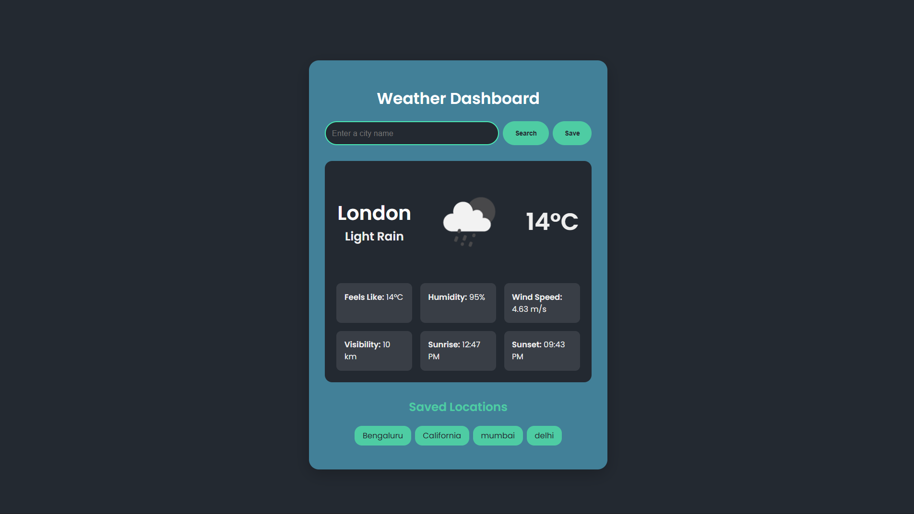

# Full Stack Weather Dashboard

A simple and elegant weather application built with the MERN stack (MongoDB, Express, React, Node.js). It allows users to search for the current weather in any city, view detailed information, and save their favorite locations for quick access.

## Live Preview



## Features

-   **Current Weather Data**: Get real-time weather information for any city.
-   **Detailed Information**: Includes temperature, "feels like" temperature, humidity, wind speed, visibility, sunrise, and sunset times.
-   **Save Locations**: Users can save their favorite cities to the database.
-   **Quick Access**: Click on a saved location to instantly see its weather.
-   **Responsive Design**: A clean and modern UI that works on various screen sizes.

## Tech Stack

-   **Frontend**: React.js
-   **Backend**: Node.js, Express.js
-   **Database**: MongoDB with Mongoose
-   **API**: [OpenWeatherMap API](https://openweathermap.org/api)

## Setup and Installation

Follow these steps to run the project locally.

### Prerequisites

-   [Node.js](https://nodejs.org/) installed
-   [MongoDB](https://www.mongodb.com/try/download/community) installed and running locally.
-   An API key from [OpenWeatherMap](https://openweathermap.org/).

### 1. Backend Setup

Navigate to the server directory and install dependencies:

```bash
cd server
npm install
```

Create a `.env` file in the `server` directory and add your configuration:

```env
MONGODB_URI=mongodb://localhost:27017/weather-app
API_KEY=your_openweathermap_api_key
PORT=5000
```

Start the backend server:

```bash
npm run dev
```

The server will be running on `http://localhost:5000`.

### 2. Frontend Setup

Open a new terminal, navigate to the client directory, and install dependencies:

```bash
cd client
npm install
```

Start the React development server:

```bash
npm start
```

The application will open automatically in your browser at `http://localhost:3000`.